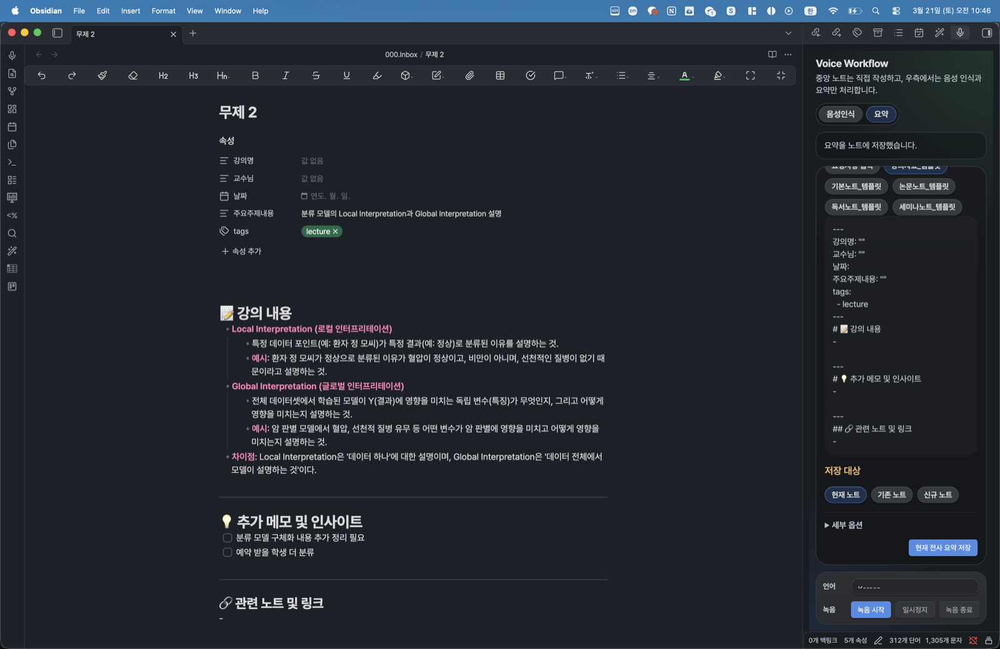
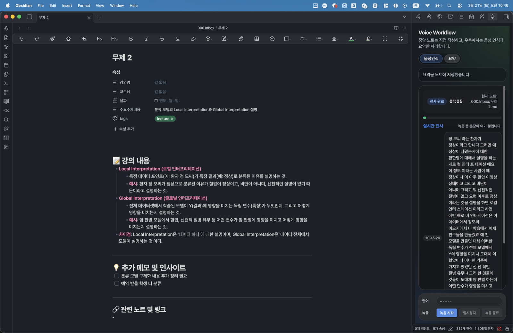
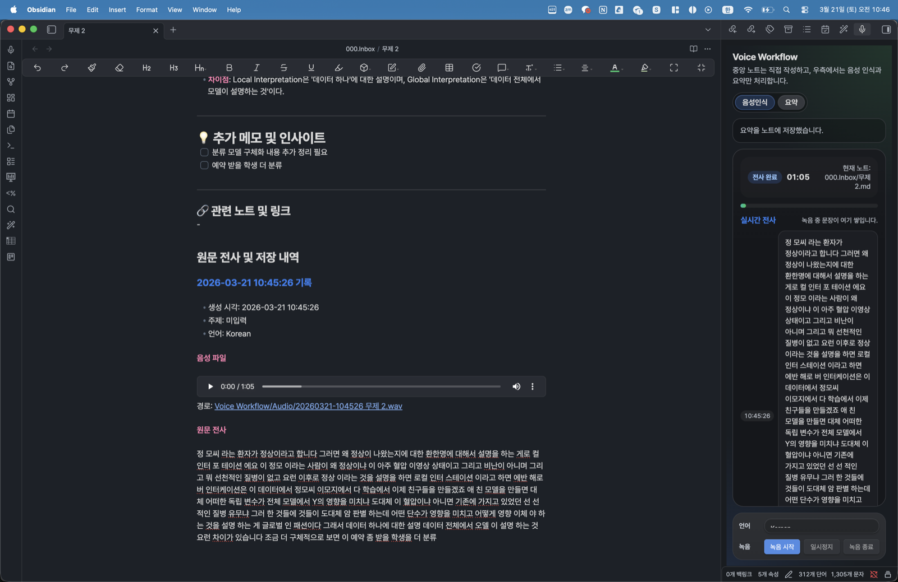

# Voice Workflow

[](https://github.com/roar-jar/obsidian-voice-workflow)
[](LICENSE)
[](https://github.com/roar-jar/obsidian-voice-workflow/commits/main)

Obsidian 우측 사이드바에서 음성 녹음, 실시간 전사, 템플릿 기반 요약, 원문 보관을 처리하는 플러그인입니다.

현재 macOS에서 가장 많이 검증됐고, Windows는 `auto / windows-speech / openai` 구조와 fallback 경로까지 반영돼 있지만 아직 실제 Windows 장비에서 최종 검증되지는 않았습니다.

## 화면 미리보기

- 요약 저장 화면: 템플릿을 적용해 노트 본문 상단에 구조화된 요약을 저장합니다.



- 실시간 전사 화면: 녹음 중 우측 패널에서 전사 문장이 시간 순서대로 쌓입니다.



- 원문/오디오 아카이브 화면: 저장 후 노트 하단에 음성 파일과 원문 전사가 함께 보관됩니다.



## 핵심 기능

- 우측 패널에서 `녹음 시작`, `일시정지`, `녹음 종료`
- 녹음 중 실시간 전사 피드 표시
- `auto / macOS Local Speech / Windows Speech / OpenAI` STT 경로 지원
- OpenAI, Ollama, Claude, Gemini 중 하나를 선택해 요약/번역
- 볼트의 템플릿 폴더를 읽어 요약 템플릿으로 사용
- 일반 회의, 강의, 1:1, 의사결정, 커스텀 요약 에이전트 지침 지원
- 녹음 전 동의 확인과 동의문 복사
- 회의 참여자, 안건, 동의 여부, 녹음 시각, Provider 정보를 노트 frontmatter에 저장
- 최종 노트 상단에는 템플릿 요약 저장
- 노트 하단에는 음성 파일과 원문 전사 아카이브 저장

## 파일 구성

- `manifest.json`: Obsidian 플러그인 메타데이터
- `main.js`: 플러그인 로직
- `styles.css`: 우측 사이드바 UI 스타일
- `versions.json`: 버전 정보
- `scripts/`: macOS STT 보조 스크립트

## 설치 방법

1. 이 폴더를 Obsidian 볼트의 `.obsidian/plugins/voice-summary-workflow/` 아래로 복사합니다.
2. Obsidian을 다시 열거나 `Reload app without saving`를 실행합니다.
3. `설정 > Community plugins`에서 `Voice Workflow`를 활성화합니다.
4. 필요하면 `설정 > Voice Workflow 설정 > 시작 시 사이드바 자동 열기`를 켭니다.

## 초기 설정

플러그인 설정에서 아래 항목을 확인합니다.

### STT

- `STT Provider`
  - `Auto`: macOS는 로컬 Speech, Windows는 Speech 누적본, 그 외는 OpenAI STT
  - `macOS Local Speech`: macOS 로컬 전사
  - `Windows Speech`: Windows 실시간 전사 누적본 + OpenAI fallback
  - `OpenAI Compatible`: OpenAI 호환 STT API
- `Source Language`
- `Translate To Korean`

### LLM Provider

- `AI Provider`
  - `OpenAI`
  - `Ollama`
  - `Claude`
  - `Gemini`
- Provider별 API Key
- Provider별 Base URL
- Provider별 Model
- 기본 요약 에이전트 지침
- 녹음 전 동의 확인 요구 여부와 동의 메시지

권장 조합:

- 전사: `macOS Local Speech`
- 요약/번역: `Gemini` 또는 `Claude` 또는 `OpenAI`
- 로컬 요약: `Ollama`

Ollama 예시:

1. Ollama를 실행합니다.
2. 사용할 모델을 받습니다. 예: `ollama pull qwen3`
3. 플러그인 설정에서 `AI Provider`를 `Ollama Local`로 선택합니다.
4. `Ollama Base URL`은 기본값 `http://localhost:11434`를 사용합니다.
5. `Ollama Model`에 받은 모델 이름을 입력합니다. 예: `qwen3`

참고: Ollama는 요약/번역 LLM Provider입니다. 음성 전사는 `macOS Local Speech`, `Windows Speech`, `OpenAI Compatible STT` 중 하나를 사용합니다.

Windows 권장 조합:

- 전사: `Auto` 또는 `Windows Speech`
- 요약/번역: `Gemini` 또는 `Claude` 또는 `OpenAI`

## 사용 흐름

1. Obsidian 우측의 `Voice Workflow` 패널을 엽니다.
2. 가운데 노트에서 메모를 작성합니다.
3. 우측 패널에서 동의문을 복사하거나 참여자에게 직접 알린 뒤 `참여자 녹음/전사 동의 확인`을 체크합니다.
4. `음성인식` 탭에서 녹음을 시작합니다.
5. 실시간 전사가 우측 피드에 쌓이는지 확인합니다.
6. `녹음 종료`를 누르면 최종 전사가 정리됩니다.
7. `요약` 탭에서 템플릿을 선택하거나 요청사항을 직접 입력합니다.
8. 세부 옵션에서 참여자, 사전 메모/안건, 주제, 요약 에이전트 지침을 확인합니다.
9. 저장 대상을 `현재 노트`, `기존 노트`, `신규 노트` 중 선택합니다.
10. `현재 전사 요약 저장`을 누르면:
   - 템플릿 요약이 노트 상단에 저장되고
   - `원문 전사 및 저장 내역` 섹션 아래에 오디오와 원문 전사가 보관됩니다.
   - 회의 메타데이터가 frontmatter에 저장됩니다.

## 템플릿 사용

- 기본적으로 Obsidian 템플릿 폴더를 읽습니다.
- 템플릿이 없거나 원하는 형식이 없으면 `요청사항 입력`으로 직접 요약 형식을 지정할 수 있습니다.
- frontmatter가 포함된 템플릿은 가능한 한 상단 속성으로 유지되도록 처리합니다.

## 저장 형식

요약 노트는 대략 아래 구조로 저장됩니다.

```md
---
type: voice-meeting-note
meeting_title: "3월 21일 회의 정리"
meeting_date: 2026-03-21
meeting_source: manual
participants: ["홍길동", "김철수"]
agenda: "출시 일정과 담당자 확정"
recording_started_at: 2026-03-21T01:33:00.000Z
recording_ended_at: 2026-03-21T01:43:00.000Z
duration_seconds: 600
consent_confirmed: true
consent_method: "manual"
stt_provider: "macOS Local Speech"
stt_model: "macOS Speech.framework"
ai_provider: "Ollama Local"
summary_model: "qwen3"
agent_instruction: "meeting"
audio_file: "Voice Workflow/Audio/20260321-103346 회의 정리.wav"
transcript_language: "Korean"
transcript_chars: 1234
강의명: ""
교수님: ""
날짜:
주요주제내용: ""
tags:
  - lecture
---

# 📝 강의 내용
...

## 원문 전사 및 저장 내역

### 2026-03-21 10:33:46 기록

- 생성 시각: 2026-03-21 10:33:46
- 주제: 로컬 인터프리테이션과 암 예측
- 언어: Korean

**음성 파일**

![[Voice Workflow/Audio/20260321-103346 무제 1.wav]]
경로: [[Voice Workflow/Audio/20260321-103346 무제 1.wav]]

**원문 전사**

이 사람이 병력 이런 정보들이 있고...
```

## macOS 로컬 STT

- `Speech.framework` 기반 전사를 사용합니다.
- 첫 실행 시 `Speech Recognition` 권한 허용이 필요할 수 있습니다.
- 실시간 전사는 환경에 따라 Web Speech 또는 로컬 미리보기 경로를 사용합니다.

## Windows 지원 상태

- `Auto`를 선택하면 Windows에서는 `Windows Speech` 경로를 우선 사용합니다.
- 실시간 전사는 브라우저/Electron `SpeechRecognition` 누적본을 사용합니다.
- 최종 전사는 실시간 누적본을 우선 사용하고, 비어 있으면 OpenAI STT로 fallback 할 수 있습니다.
- 현재 구조 지원은 완료됐지만, 실제 Windows 장비에서의 최종 검증은 아직 진행하지 못했습니다.

## 주의 사항

- API Key는 Obsidian 플러그인 설정 데이터에 평문 저장됩니다.
- Provider별 과금은 각 서비스 정책을 따릅니다.
- macOS 권한 상태나 Electron 환경에 따라 실시간 전사 동작이 달라질 수 있습니다.
- 긴 녹음은 전사 시간이 길어질 수 있습니다.

## 개인정보 및 네트워크 사용

- 이 플러그인은 사용자가 `녹음 시작`을 누른 뒤에만 마이크 오디오를 녹음합니다.
- 녹음 파일은 기본적으로 현재 볼트의 `Voice Workflow/Audio` 폴더에 WAV 파일로 저장됩니다.
- `macOS Local Speech`와 `Windows Speech` 경로는 가능한 로컬/시스템 전사를 우선 사용합니다.
- `OpenAI Compatible API` STT를 선택하면 녹음 오디오가 설정한 OpenAI 호환 STT 서버로 전송됩니다.
- AI 요약/번역을 실행하면 전사, 사전 메모/안건, 선택한 노트 본문 일부가 선택한 AI Provider(OpenAI 호환, Ollama, Claude, Gemini)로 전송될 수 있습니다.
- Ollama 기본 설정(`http://localhost:11434`)은 로컬 서버 호출이며 별도 API Key가 필요하지 않습니다.
- 이 플러그인은 광고, 원격 측정, 사용량 추적 코드를 포함하지 않습니다.
- API Key는 Obsidian 플러그인 설정 파일에 저장됩니다. 공유 장치에서는 별도 보안 관리가 필요합니다.
- macOS 로컬 전사를 위해 플러그인 폴더의 `scripts/macos-transcribe.js`를 `osascript`로 실행합니다.

## 개발 메모

- 이 저장소는 Obsidian 플러그인 소스만 포함합니다.
- 실제 볼트의 활성 플러그인 폴더에 복사해 테스트할 수 있습니다.
- 배포 전 최소 확인:
  - `node --check main.js`
  - `git diff --check`
  - Obsidian 재시작 후 패널 로드 확인
  - 녹음, 저장, 요약, 아카이브 저장 확인

## 커뮤니티 플러그인 제출 준비

- GitHub Release 태그/이름은 `manifest.json`의 버전과 정확히 같아야 합니다. 예: `0.4.0`
- Release asset에는 `main.js`, `manifest.json`, `styles.css`를 개별 파일로 첨부해야 합니다.
- `community-plugins.json` 제출 entry의 `id`, `name`, `author`, `description`은 `manifest.json`과 일치해야 합니다.
- 이 플러그인은 데스크톱 전용입니다. `manifest.json`의 `isDesktopOnly`가 `true`로 설정되어 있습니다.

## 라이선스

MIT License. 자세한 내용은 `LICENSE` 파일을 확인하세요.
