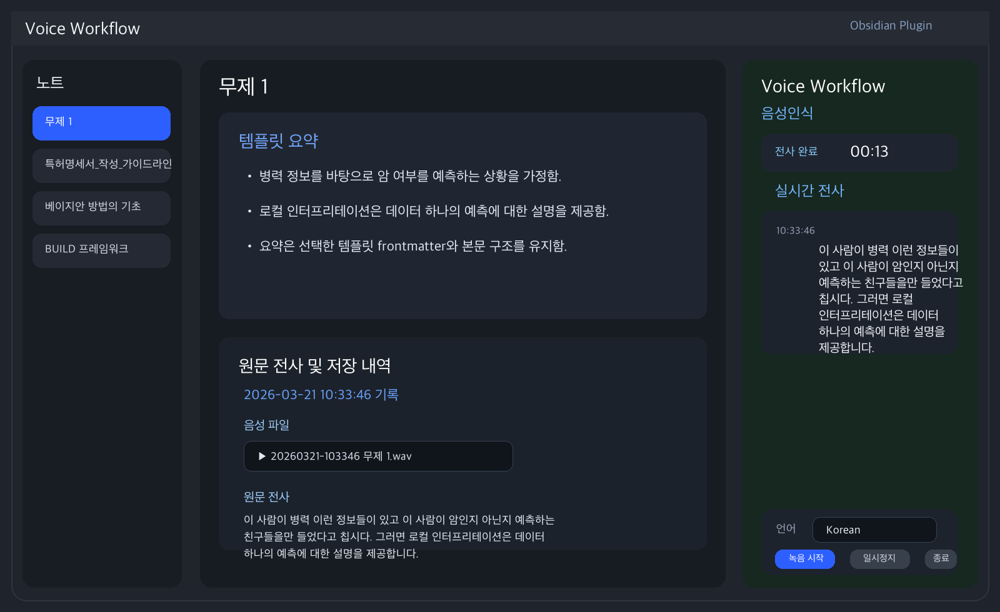
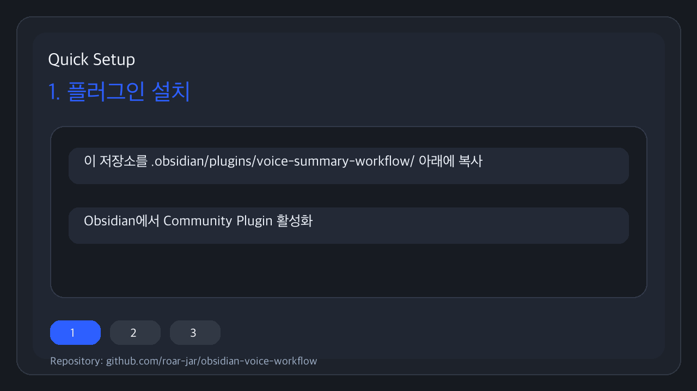

# Voice Workflow

Obsidian 우측 사이드바에서 음성 녹음, 실시간 전사, 템플릿 기반 요약, 원문 보관을 처리하는 플러그인입니다.



## 화면 미리보기

- 전체 워크플로우: 우측 패널에서 녹음과 전사를 확인하고, 중앙 노트에는 템플릿 요약과 원문 아카이브를 함께 저장합니다.
- 빠른 시작 데모:



## 핵심 기능

- 우측 패널에서 `녹음 시작`, `일시정지`, `녹음 종료`
- 녹음 중 실시간 전사 피드 표시
- macOS 로컬 STT 또는 OpenAI 호환 STT 사용
- OpenAI, Claude, Gemini 중 하나를 선택해 요약/번역
- 볼트의 템플릿 폴더를 읽어 요약 템플릿으로 사용
- 최종 노트 상단에는 템플릿 요약 저장
- 노트 하단에는 음성 파일과 원문 전사 아카이브 저장

## 파일 구성

- `manifest.json`: Obsidian 플러그인 메타데이터
- `main.js`: 플러그인 로직
- `styles.css`: 우측 사이드바 UI 스타일
- `versions.json`: 버전 정보
- `scripts/`: macOS STT 보조 스크립트

## 설치 방법

1. 이 폴더를 Obsidian 볼트의 `.obsidian/plugins/voice-summary-workflow/` 아래로 복사합니다.
2. Obsidian을 다시 열거나 `Reload app without saving`를 실행합니다.
3. `설정 > Community plugins`에서 `Voice Workflow`를 활성화합니다.

## 초기 설정

플러그인 설정에서 아래 항목을 확인합니다.

### STT

- `STT Provider`
  - `macOS Local Speech`: macOS 로컬 전사
  - `OpenAI Compatible`: OpenAI 호환 STT API
- `Source Language`
- `Translate To Korean`

### LLM Provider

- `AI Provider`
  - `OpenAI`
  - `Claude`
  - `Gemini`
- Provider별 API Key
- Provider별 Base URL
- Provider별 Model

권장 조합:

- 전사: `macOS Local Speech`
- 요약/번역: `Gemini` 또는 `Claude` 또는 `OpenAI`

## 사용 흐름

1. Obsidian 우측의 `Voice Workflow` 패널을 엽니다.
2. 가운데 노트에서 메모를 작성합니다.
3. 우측 패널 `음성인식` 탭에서 녹음을 시작합니다.
4. 실시간 전사가 우측 피드에 쌓이는지 확인합니다.
5. `녹음 종료`를 누르면 최종 전사가 정리됩니다.
6. `요약` 탭에서 템플릿을 선택하거나 요청사항을 직접 입력합니다.
7. 저장 대상을 `현재 노트`, `기존 노트`, `신규 노트` 중 선택합니다.
8. `현재 전사 요약 저장`을 누르면:
   - 템플릿 요약이 노트 상단에 저장되고
   - `원문 전사 및 저장 내역` 섹션 아래에 오디오와 원문 전사가 보관됩니다.

## 템플릿 사용

- 기본적으로 Obsidian 템플릿 폴더를 읽습니다.
- 템플릿이 없거나 원하는 형식이 없으면 `요청사항 입력`으로 직접 요약 형식을 지정할 수 있습니다.
- frontmatter가 포함된 템플릿은 가능한 한 상단 속성으로 유지되도록 처리합니다.

## 저장 형식

요약 노트는 대략 아래 구조로 저장됩니다.

```md
---
강의명: ""
교수님: ""
날짜:
주요주제내용: ""
tags:
  - lecture
---

# 📝 강의 내용
...

## 원문 전사 및 저장 내역

### 2026-03-21 10:33:46 기록

- 생성 시각: 2026-03-21 10:33:46
- 주제: 로컬 인터프리테이션과 암 예측
- 언어: Korean

**음성 파일**

![[Voice Workflow/Audio/20260321-103346 무제 1.wav]]
경로: [[Voice Workflow/Audio/20260321-103346 무제 1.wav]]

**원문 전사**

이 사람이 병력 이런 정보들이 있고...
```

## macOS 로컬 STT

- `Speech.framework` 기반 전사를 사용합니다.
- 첫 실행 시 `Speech Recognition` 권한 허용이 필요할 수 있습니다.
- 실시간 전사는 환경에 따라 Web Speech 또는 로컬 미리보기 경로를 사용합니다.

## 주의 사항

- API Key는 Obsidian 플러그인 설정 데이터에 평문 저장됩니다.
- Provider별 과금은 각 서비스 정책을 따릅니다.
- macOS 권한 상태나 Electron 환경에 따라 실시간 전사 동작이 달라질 수 있습니다.
- 긴 녹음은 전사 시간이 길어질 수 있습니다.

## 개발 메모

- 이 저장소는 Obsidian 플러그인 소스만 포함합니다.
- 실제 볼트의 활성 플러그인 폴더에 복사해 테스트할 수 있습니다.
- 배포 전 최소 확인:
  - `node --check main.js`
  - Obsidian 재시작 후 패널 로드 확인
  - 녹음, 저장, 요약, 아카이브 저장 확인

## 라이선스

MIT License. 자세한 내용은 `LICENSE` 파일을 확인하세요.
